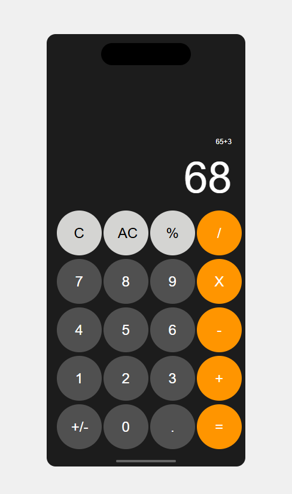

# 📱 iOS Calculator App Clone

A fully functional **iOS Calculator app clone** built using **HTML, CSS, and JavaScript**. This project recreates the look and behavior of the native iOS calculator while demonstrating core front-end development skills including UI design, DOM manipulation, and event handling — all without using any frameworks or libraries.

---

## ✨ Features

- ✅ iOS-inspired user interface  
- ✅ Basic calculator operations:
  - Addition (+)
  - Subtraction (−)
  - Multiplication (×)
  - Division (÷)
- ✅ Percentage (%) calculation  
- ✅ Sign toggle (+ / −)  
- ✅ Clear & reset functionality  
- ✅ Real-time display updates  
- ✅ Responsive layout (mobile & desktop friendly)  
- ✅ Keyboard & button input support

---

## 🛠️ Built With

- **HTML5** – Markup and structure  
- **CSS3** – Styling & layout  
- **Vanilla JavaScript** – Calculator logic and UI interactions

---

## 🎯 Purpose

This project was built to:

- Practice cloning real-world UI designs
- Improve vanilla JavaScript problem-solving skills
- Learn DOM manipulation and event-driven programming
- Strengthen responsive CSS layout techniques

---

## 🚀 Getting Started

Follow these steps to run the project locally:

1. Clone the repository
   ```bash
   git clone https://github.com/your-username/ios-calculator-clone.git
2. Navigate to the project folder
3. Simply open index.html in your browser.

## Project Structure



